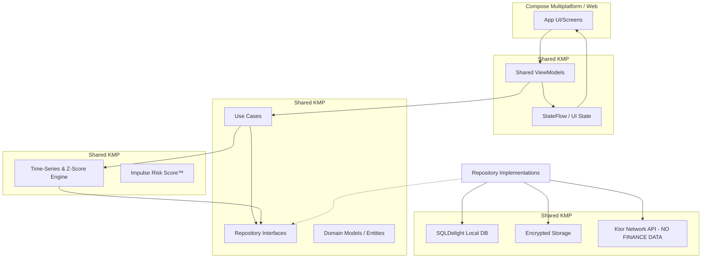

# Impend - Privacy-First AI Behavioral Finance Coach

## Mission
Impend is a production-grade, globally scalable, privacy-first AI-powered behavioral finance coaching platform. 
Built using Kotlin Multiplatform (KMP) with strict MVVM architecture, it ensures all sensitive financial data stays entirely on-device.

## Non-Negotiable Principles
- **100% On-Device Financial Data**: No raw expense data ever leaves the device.
- **Strict MVVM**: UI -> ViewModel -> Domain <- Data.
- **Clean Architecture**: Repository pattern is mandatory.
- **Shared Business Logic**: The KMP `shared` module contains all core business rules and analytics.
- **No Ads, No Bank Scraping**: Privacy is our core feature.

---

## Architectural Overview

## Module Structure
- `:composeApp`
  - `/commonMain`: Shared compose UI, screen navigations.
  - `/androidMain`: Android specific entry point.
  - `/iosMain`: iOS specific entry point.
- `:shared`
  - `/commonMain`: All viewmodels, domain models, algorithms, and data access.
  - `/androidMain`: Android specific driver/sql/platform dependencies.
  - `/iosMain`: iOS specific driver/sql/platform dependencies.

## Key Features
### Free Tier
- Manual expense entry & Category tagging
- Mood logging (1-5 scale)
- Weekly insights (max 3) & Basic charts

### Pro Tier (Subscription)
- Unlimited insights
- Impulse Risk Score™ algorithm
- Behavioral clustering & Anomaly detection
- PDF export
