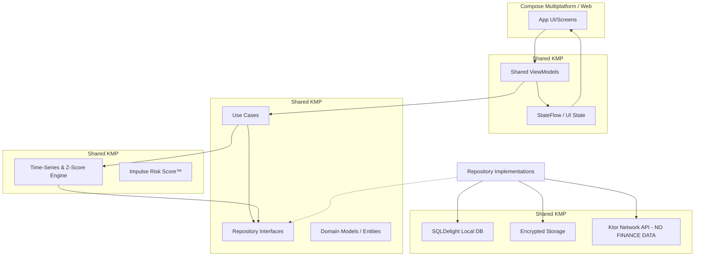

# Impend - Privacy-First AI Behavioral Finance Coach

## Mission
Impend is a production-grade, globally scalable, privacy-first AI-powered behavioral finance coaching platform. 
Built using Kotlin Multiplatform (KMP) with strict MVVM architecture, it ensures all sensitive financial data stays entirely on-device.

## Non-Negotiable Principles
- **100% On-Device Financial Data**: No raw expense data ever leaves the device.
- **Strict MVVM**: UI -> ViewModel -> Domain <- Data.
- **Clean Architecture**: Repository pattern is mandatory.
- **Shared Business Logic**: The KMP `shared` module contains all core business rules and analytics.
- **No Ads, No Bank Scraping**: Privacy is our core feature.

---

## Architectural Overview



## Module Structure
- `:composeApp`
  - `/commonMain`: Shared compose UI, screen navigations.
  - `/androidMain`: Android specific entry point.
  - `/iosMain`: iOS specific entry point.
- `:shared`
  - `/commonMain`: All viewmodels, domain models, algorithms, and data access.
  - `/androidMain`: Android specific driver/sql/platform dependencies.
  - `/iosMain`: iOS specific driver/sql/platform dependencies.

## Key Features

### Free Tier
- Manual expense entry & Category tagging
- Mood logging (1-5 scale)
- Weekly insights (max 3) & Basic charts
- **Global Context**: Multi-currency support (USD, EUR, GBP, JPY, INR) and multi-lingual UI (English, Spanish).

### Pro Tier (Subscription)
- Unlimited insights
- Impulse Risk Score™ algorithm
- Behavioral clustering & Anomaly detection
- PDF export

---

## CI/CD & Distribution

### Android Release Pipeline
The project includes a robust GitHub Actions workflow for automated Android App Bundle (AAB) distribution to the Google Play Store.

- **Workflow**: `.github/workflows/android_release.yml`
- **Triggers**: On push to `release/*` branches or manual dispatch.
- **Process**: 
  - Builds signed AAB using Java 17.
  - Automatically uploads to the **Internal Testing** track on Google Play Console.

#### Required GitHub Secrets
To enable the release pipeline, configure the following secrets in your repository:
- `KEYSTORE_BASE64`: Base64 encoded `.jks` keystore file.
- `KEYSTORE_PASSWORD`: Password for the keystore.
- `KEY_ALIAS`: Alias for the signing key.
- `KEY_PASSWORD`: Password for the signing key.
- `PLAY_CONSOLE_JSON`: Service account JSON for Google Play API access.

---

## Getting Started

### Prerequisites
- Android Studio Ladybug or newer.
- JDK 17.
- Xcode (for iOS builds).

### Running the App
1. Clone the repository.
2. Open in Android Studio.
3. Sync Gradle.
4. Run the `:composeApp` module on an emulator or physical device.

---

## Testing
Run shared module tests using:
```bash
./gradlew :shared:allTests
```
