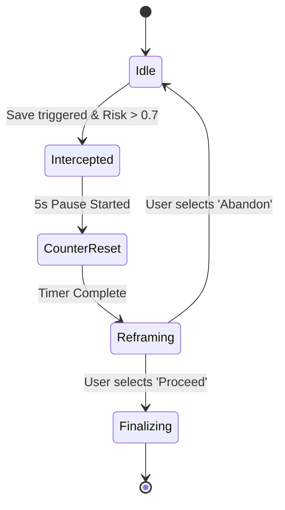

# ARCH-008: Resilience Prompts

## 1. Overview
The "Resilience Prompt" system interrupts the logging flow when a high-risk expense is detected. It uses a state machine to manage the transition between "Drafting", "Intercepted", "Reframing", and "Finalizing".

## 2. Component Design

### 2.1 Resilience Engine (Shared)
A new component `ResilienceEngine` will manage the content library and trigger logic.

```kotlin
class ResilienceEngine(
    private val riskEngine: ImpulseRiskEngine
) {
    fun shouldIntervene(expenses: List<Expense>, current: Expense): Boolean {
        return riskEngine.calculateRiskScore(expenses, current) > 0.7
    }

    fun getRandomPrompt(): String {
        return prompts.random()
    }

    private val prompts = listOf(
        "Will this matter in 10 minutes? 10 days? 10 months?",
        "Does this purchase align with your current pledges?",
        "Pause. Take one deep breath. Do you still want this?",
        "Is this a 'Need' or a 'Dopamine Hit'?",
        "Your future self will thank you for pausing. Proceed?"
    )
}
```

### 2.2 UI State Machine (App)
The `AddExpenseViewModel` will be updated to handle the `Interception` state.



## 3. Data Changes
No new database tables are required. We will extend the `AddExpenseUiState` to include an `Interception` state.

## 4. Interaction flow
1. User enters expense details.
2. User clicks "Save".
3. `AddExpenseUseCase` is called.
4. If `ResilienceEngine.shouldIntervene` is true:
    - View emits `AddExpenseUiState.InterceptionRequired`.
    - UI shows the "Pause Overlay" with a 5s countdown.
    - After countdown, the prompt is shown.
5. If user clicks "Proceed", the expense is saved.
6. If user clicks "Abandon", the flow ends without saving.

## 5. Security & Privacy
- Zero leakage: No prompts or user responses are logged outside of the local database's expense entry.
- The "Reframed" status (whether a prompt was shown and the expense was still logged) will be stored as a `customTag`: `reframed:true`.
