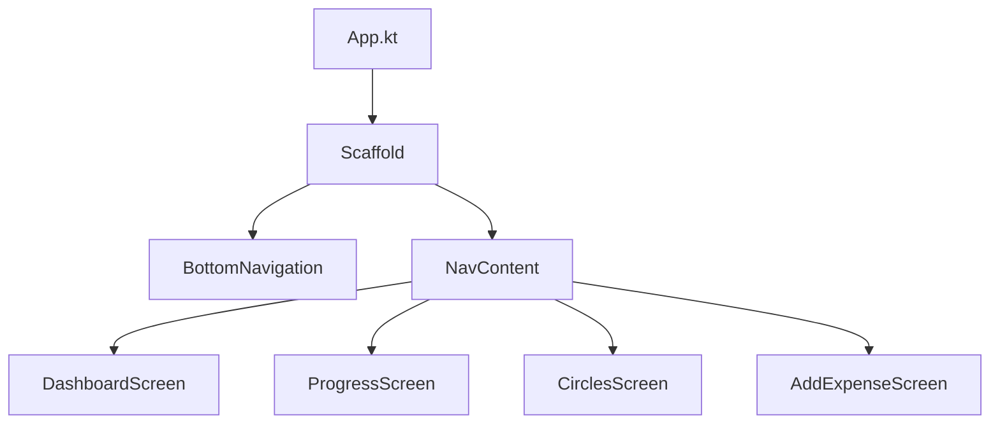

# ARCH-009: UX Refinement & Navigation

## 1. Overview
This architectural change introduces a persistent Bottom Navigation bar and refactors the Dashboard into a scrollable, space-efficient layout.

## 2. Navigation Architecture

### 2.1 Navigation State
We will maintain the `Screen` state in `App.kt` but wrap the entire application in a `Scaffold` to provide the persistent Bottom Navigation.

### 2.2 Bottom Navigation Items
- **Home**: `Dashboard`
- **Analytics**: `Progress`
- **Add**: `AddExpense` (Large central button)
- **Circles**: `Circles`

## 3. Dashboard Layout Refactor

### 3.1 Component Condensation
- **Mood Pulse**: Reduce vertical padding; use a more compact horizontal layout.
- **Insight Carousel**: Move labels inside cards or use smaller fonts to reduce white space.
- **Scroll Mechanism**: Replace the fixed `Column` in `DashboardScreen` with a `LazyColumn`.

### 3.2 real estate optimization
| Section | Current State | Proposed Refinement |
| :--- | :--- | :--- |
| Header | Large fixed text | Smaller, semantic H4 header |
| Insights | Tall cards | Compact cards with max-height |
| Mood | Large circular pulse | Sleek horizontal pill-based status |
| List | Often hidden | Integrated into LazyColumn for full visibility |

## 4. UI Scalability
- **Circles Button Fix**: Use `softWrap = true` and `maxLines = 1` with text overflow or adaptive font sizing for the Circles navigation item.
- **Scaffold Padding**: Ensure `contentPadding` from the `Scaffold` is respected to prevent content being buried behind the Bottom Nav.

## 5. Screen Transitions
- **Frictionless Entry**: The `AddExpense` screen will no longer be an overlay but a primary destination in the Nav bar, though the "Save" action still returns to Dashboard.
