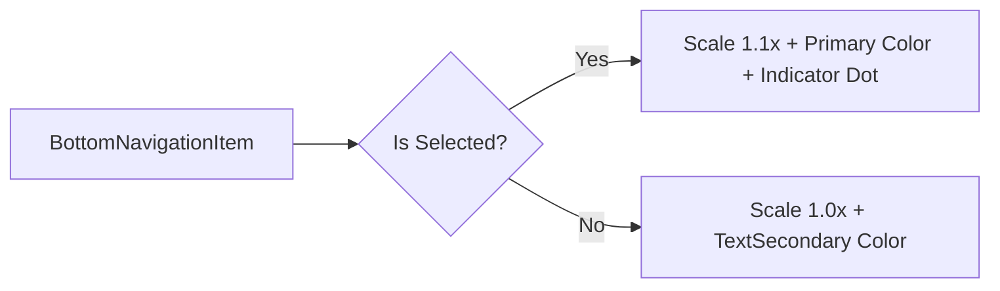

# ARCH-010: Visual Polish & Chart Stability

## 1. Overview
This architecture covers the hardening of the `TrendChart` component and the aesthetic modernization of the navigation system.

## 2. Chart Strengthening

### 2.1 Single Point Rendering
The current `TrendChart` returns early if `dataPoints.size < 2`. We will refactor this to draw a single point or a horizontal trend line if only one day of data exists.

### 2.2 Visibility Guard
We will wrap the `Canvas` in a `Box` with explicit minimum dimensions to ensure it doesn't collapse to zero height inside scrollable containers.

## 3. Modern Navigation Spec

### 3.1 Custom Navigation Items
We will create a `ModernBottomNavItem` that supports:
- **Active State Animation**: Subtle vertical offset and scale-up (1.0 -> 1.1x).
- **Selection Indicator**: A small dot or pill below the icon when active.
- **Color Transitions**: Smooth cross-fade between `TextSecondary` and `Primary`.

### 3.2 Iconography
Instead of Emojis, we will use Material Icons (if dependency allows) or custom SVG paths for a premium look.

